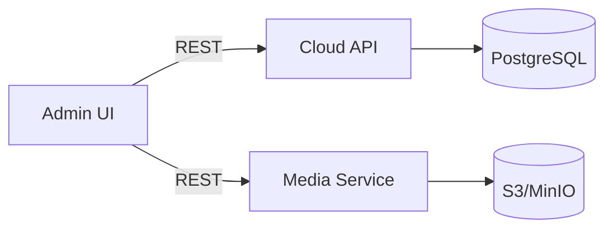

# Drill Admin Service

Административная панель для управления данными буровых установок: иерархией `edge`, тегами, связью тегов с блоками, конфигурациями виджетов и таблиц, а также загрузкой файлов эмуляции.

## Назначение
- централизованное управление справочниками (`edge`, `tag`)
- настройка отображения в `view` (виджеты, таблицы, страницы)
- контроль связки тегов с блоками (edge↔tag)
- загрузка/синхронизация данных эмуляции
- конфигурация медиа/документов

## Ключевые экраны
- **Edges**: дерево оборудования и дочерних блоков
- **Tags**: создание/редактирование тегов с привязкой к блокам
- **Widget Layout**: конструктор виджетов по страницам
- **Table Configurator**: конструктор таблиц
- **Emulation**: загрузка и правка данных эмуляции
- **Maintenance/Media**: техобслуживание и медиа‑конфигурации

## Интеграции
- `cloud` API: CRUD для `edge`, `tag`, `current`, `customization`
- `media` API: пресайны и выдача медиа/документов



## Переменные окружения
- `VITE_API_URL` — базовый URL `cloud` API
- `VITE_MEDIA_API_URL` — базовый URL `media` API (если не задан, берется `VITE_API_URL`)
- `VITE_FILE_UPLOAD` — endpoint загрузки файла эмуляции
- `VITE_FILE_EXAMPLE` — endpoint получения примера JSON файла

## Запуск
```bash
npm install
npm run dev
```

## Сборка
```bash
npm run build
npm run preview
```

## Замечания по логике
- **Теги привязаны к блокам**: все операции в UI исходят из `edge_ids` тега.
- Конфигурации виджетов и таблиц сохраняются как кастомизации на стороне `cloud`.
